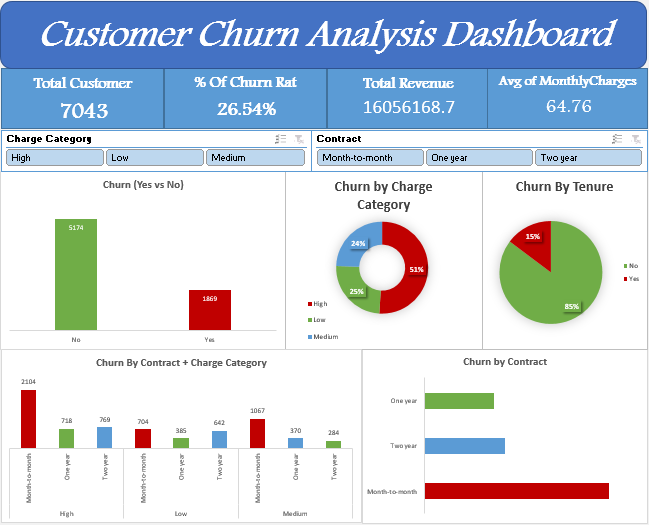

# 📊 Customer Churn Analysis Dashboard (Excel Project)

## 📌 Overview | نظرة عامة

This project analyzes customer churn behavior in a subscription-based business (SaaS model).
The goal is to identify the main drivers behind customer churn and provide actionable recommendations to improve retention and revenue stability.

يهدف هذا المشروع إلى تحليل سلوك انسحاب العملاء في شركة تعتمد على الاشتراكات، مع التركيز على تحديد الأسباب الرئيسية للانسحاب وتقديم توصيات عملية لتحسين الاحتفاظ بالعملاء وزيادة استقرار الإيرادات.

---

## 🎯 Business Problem | المشكلة

Despite steady customer growth, the company is experiencing a high churn rate, which negatively impacts long-term revenue.

رغم نمو عدد العملاء، تواجه الشركة نسبة انسحاب مرتفعة تؤثر بشكل مباشر على استقرار الإيرادات على المدى الطويل.

---

## 📂 Dataset | البيانات

* Customer ID
* Contract Type (Month-to-Month, One Year, Two Year)
* Monthly Charges
* Tenure
* Churn (Yes / No)

---

## 🧹 Data Preparation | تجهيز البيانات

* Cleaned and validated dataset
* Removed inconsistencies
* Created calculated fields:

  * Charge Category (Low / Medium / High)

---

## 📊 Key Insights | أهم النتائج

### 🇬🇧 English:

* The overall churn rate is **~27%**, indicating a serious retention issue
* Month-to-Month contracts show the highest churn rates
* High-paying customers are more likely to churn
* The most critical segment is:
  **High Price + Month-to-Month customers**
* This segment represents a major risk to revenue stability

---

### 🇸🇦 العربية:

* تبلغ نسبة انسحاب العملاء حوالي **27%**، وهي نسبة مرتفعة
* الاشتراكات الشهرية (Month-to-Month) هي الأكثر عرضة للانسحاب
* العملاء ذوو الدفع المرتفع أكثر عرضة للمغادرة
* أخطر شريحة هي:
  **العملاء ذوو الدفع المرتفع مع اشتراك شهري**
* هذه الشريحة تمثل تهديداً مباشراً لاستقرار الإيرادات

---

## 📈 Dashboard Features | مميزات الداشبورد

* KPIs:

  * Total Customers
  * Churn Rate
  * Total Revenue
  * Avg Monthly Charges

* Interactive Filters:

  * Contract
  * Charge Category

* Visual Analysis:

  * Churn (Yes vs No)
  * Churn by Contract
  * Churn by Charge Category
  * Churn by Tenure
  * Root Cause Analysis (Contract + Pricing)

---

## 💡 Recommendations | التوصيات

### 🇬🇧 English:

1. Encourage high-value customers to switch from monthly to long-term contracts
2. Provide targeted retention offers for high-risk customers
3. Monitor customer engagement and intervene early
4. Align pricing with perceived value to reduce churn

---

### 🇸🇦 العربية:

1. تشجيع العملاء ذوي القيمة العالية على التحول إلى عقود طويلة المدى
2. تقديم عروض مخصصة للعملاء المعرضين للانسحاب
3. مراقبة تفاعل العملاء والتدخل المبكر
4. تحسين التوازن بين السعر والقيمة المقدمة

---

## 🛠 Tools Used | الأدوات

* Microsoft Excel
* Pivot Tables
* Data Analysis
* Dashboard Design

---

## 🖼️ Dashboard Preview

  

---

## 🚀 Project Outcome | نتيجة المشروع

This project demonstrates the ability to:

* Analyze customer behavior
* Identify root causes of churn
* Translate data into business insights
* Build interactive dashboards for decision-making

يوضح هذا المشروع القدرة على:

* تحليل سلوك العملاء
* تحديد الأسباب الجذرية للمشاكل
* تحويل البيانات إلى قرارات عملية
* بناء داشبورد احترافي يدعم اتخاذ القرار
